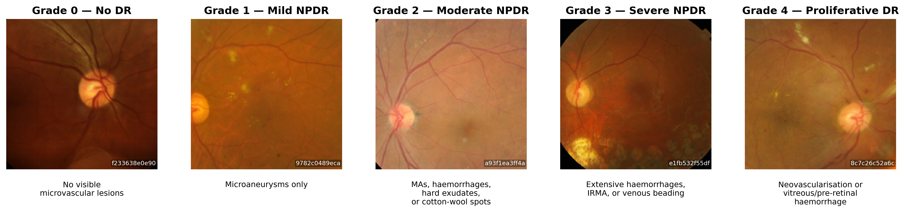
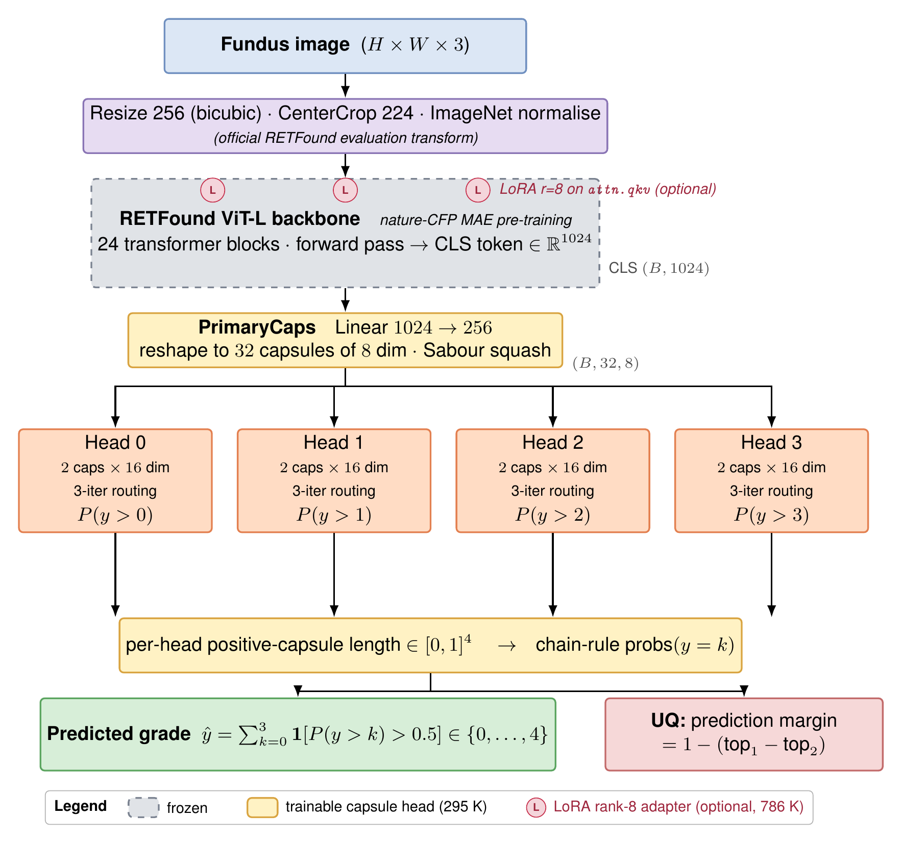

# RETFound-CapsNet

**Ordinal Capsule Regression on Retinal Foundation Features: A parameter-efficient head for diabetic retinopathy with native uncertainty.**

This repository contains the code, configs, and lightweight result artifacts that accompany the paper *Ordinal Capsule Regression on Retinal Foundation Features* (draft in `paper/submission/article.pdf`). It trains a small capsule head (~295K params) on frozen RETFound ViT-L features, plus an optional LoRA rank-8 fine-tune (~1.08M params), and evaluates on APTOS-2019, IDRiD, and Messidor-2 with a capsule-native uncertainty signal.



## Abstract

Diabetic retinopathy (DR) is graded on a five-point ordinal scale, but most deep-learning systems still treat it as a flat five-way classification problem. We take the ordinal structure seriously and put a small capsule-network head on top of frozen RETFound features, using Niu et al.'s K−1 binary decomposition so that each head asks a monotone question ("is the grade above threshold *k*?"). On APTOS-2019, evaluated with three seeds over five folds, the frozen head reaches a quadratic weighted kappa (QWK) of **0.8932 ± 0.0004** at only **295K** trainable parameters—roughly a thousand times smaller than fully fine-tuning the ViT-L backbone. A LoRA variant (rank 8, ~1.08M trainable parameters) lifts QWK to **0.9127 ± 0.0008** across three seeds and five folds, beating every CapsNet-based DR method we are aware of and sitting above strong CNN ensembles. The capsule length is a probability, which gives an uncertainty signal for free: the prediction margin `1 − (p_top1 − p_top2)` separates correct from misclassified samples with `p < 10⁻³⁰⁰` on APTOS, `p ≈ 5×10⁻⁴` on IDRiD, and `p < 10⁻³⁰⁰` within Messidor-2, without any additional loss term. A one-line post-hoc rank calibration recovers APTOS→Messidor-2 QWK from 0.014 to 0.222 and nearly triples binary sensitivity at equal AUC. We also report honest negatives: asymmetric ordinal loss, KC loss, the non-uniform squash of Gogulamudi et al., and routing-agreement variance all do nothing or hurt. Full 5-fold CV runs in ~2 minutes on a consumer MacBook (MPS).

## Architecture



RETFound (frozen or LoRA-adapted on `attn.qkv`) → PrimaryCaps → four K−1 binary DigitCaps heads with dynamic routing → chain-rule 5-class probabilities + prediction margin UQ.

## Headline results (APTOS-2019, 3 seeds × 5-fold CV)

| Model | QWK | Accuracy | Macro-F1 | MAE | Trainable params |
|---|---:|---:|---:|---:|---:|
| Linear + CE | 0.8389 ± 0.0122 | 0.7971 | 0.6011 | 0.291 | 5K |
| MLP + CE | 0.8783 ± 0.0022 | 0.8057 | 0.6271 | 0.259 | 132K |
| Vanilla 5-class CapsNet | 0.8696 ± 0.0026 | 0.8061 | 0.6301 | 0.263 | ~300K |
| **Ordinal CapsNet (frozen)** | **0.8932 ± 0.0004** | 0.7931 | 0.6255 | 0.254 | **295K** |
| **Ordinal CapsNet + LoRA r=8** | **0.9127 ± 0.0008** | **0.8237** | **0.6627** | **0.214** | **1.08M** |

See `results/aptos_final_table.md` for the full 10-row ablation (including asymmetric loss, KC loss, and non-uniform squash negatives), and `results/literature_comparison_table.md` for a side-by-side against published DR methods.

## Install

Python 3.12, managed with [`uv`](https://github.com/astral-sh/uv).

```bash
git clone https://github.com/vineetkumar-sudo/retfound-capsnet.git
cd retfound-capsnet
uv sync
```

This installs torch, torchvision, timm, peft, scikit-learn, matplotlib, wandb, and the Kaggle CLI into `.venv/`. All commands below are invoked via `uv run` so they pick up the project environment automatically.

## Datasets and weights

All raw datasets are gitignored; you need to obtain them yourself.

### APTOS-2019

Kaggle competition (research use only, no redistribution):

```bash
uv run kaggle competitions download -c aptos2019-blindness-detection -p data/aptos/
unzip -q data/aptos/aptos2019-blindness-detection.zip -d data/aptos/
```

Kaggle CLI authentication uses the legacy `~/.kaggle/kaggle.json` (not `KGAT_*` access tokens).

### IDRiD

Register at <https://idrid.grand-challenge.org/> and place the files so that the repo sees `data/idrid/B. Disease Grading/` with the official 413-image train set and 103-image test set.

### Messidor-2

1. Register at <https://www.adcis.net/en/third-party/messidor2/> for the raw images (ADCIS research-use licence, no redistribution). Place images under `data/messidor2/IMAGES/`.
2. Download the adjudicated 5-class DR grades from the Google Brain Kaggle release (<https://www.kaggle.com/google-brain/messidor2-dr-grades>) and place the label CSV under `data/messidor2/`.

### RETFound pretrained weights

```bash
mkdir -p data/weights
# Download RETFound_mae_natureCFP.pth from https://github.com/rmaphoh/RETFound_MAE
# and place it at data/weights/RETFound_mae_natureCFP.pth
```

The ViT-L nature-CFP MAE checkpoint is what the feature cache expects.

## Cache the frozen backbone features

Runs once per dataset; produces `data/<dataset>/features/*.npy` so that every downstream head trains on fixed feature matrices.

```bash
uv run python -c "from src.data.feature_cache import extract_aptos_features; extract_aptos_features()"
uv run python scripts/extract_idrid_features.py
uv run python scripts/extract_messidor2_features.py
```

## Reproduction

Each "Day N" experiment is a self-contained script in `scripts/`. Every command below writes its numeric artifacts into `results/<experiment>/` and, for multi-seed runs, into `results/<experiment>/seed{42,123,456}/`.

### APTOS (Days 1–5, 11)

```bash
# Day 1 — linear / MLP baselines (CE, MSE, weighted CE)
uv run python scripts/run_baselines.py --seeds 42,123,456

# Day 2 — vanilla 5-class CapsNet + margin loss
for s in 42 123 456; do uv run python scripts/run_capsnet.py --model-seed $s --output-dir results/capsnet/seed$s; done

# Day 3 — K-1 ordinal CapsNet (frozen, champion)
uv run python scripts/run_ordinal_capsnet.py --seeds 42,123,456

# Day 4 — asymmetric ordinal loss
uv run python scripts/run_asymmetric_ordinal.py --seeds 42,123,456

# Day 5A — KC Loss (differentiable QWK surrogate)
uv run python scripts/run_ordinal_kc.py --seeds 42,123,456

# Day 11 — non-uniform squash ablation
uv run python scripts/run_ordinal_capsnet.py \
    --config configs/ordinal_capsnet_nonuniform.yaml \
    --seeds 42,123,456 --no-wandb
```

### APTOS LoRA fine-tune

```bash
uv run python scripts/run_lora_ordinal.py --seeds 42,123,456 --resume
```

`--resume` skips any fold whose `preds_fold{N}.npz` already exists, so you can Ctrl-C and re-invoke. Total wall-clock on Apple M-series MPS is ~16h.

### IDRiD (Day 8)

```bash
uv run python scripts/run_idrid.py
uv run python scripts/cross_dataset_aptos_to_idrid.py
```

### Messidor-2 (Day 9)

```bash
uv run python scripts/run_messidor2.py
uv run python scripts/cross_dataset_aptos_to_messidor2.py
uv run python scripts/posthoc_rank_calibration_messidor2.py
```

### Aggregated tables and paper figures

```bash
# Aggregate per-day tables into the paper-ready ablations
uv run python scripts/aggregate_day6.py
uv run python scripts/aggregate_day8.py
uv run python scripts/aggregate_day9.py

# Regenerate every figure referenced in the paper
uv run python scripts/make_day6_figures.py --strict
uv run python scripts/make_day8_figures.py
uv run python scripts/make_day9_figures.py --strict
uv run python scripts/make_lora_figures.py --strict
uv run python scripts/make_lora_rampup_figure.py
uv run python scripts/make_grade_samples_figure.py
uv run python scripts/make_architecture_diagram.py

# Compile the paper (requires pdflatex in TeX Live 2020+)
cd paper/submission && pdflatex article.tex && pdflatex article.tex
```

## Repository structure

```
retfound-capsnet/
├── src/
│   ├── models/
│   │   ├── baselines.py          # Linear + MLP heads
│   │   ├── capsnet.py            # Vanilla 5-class CapsNet + routing history hook
│   │   └── ordinal_capsnet.py    # Shared PrimaryCaps + K-1 binary DigitCaps heads
│   ├── losses/
│   │   ├── margin_loss.py        # Sabour margin loss
│   │   ├── ordinal_loss.py       # K-1 decomposition + predict_grade_from_heads
│   │   ├── asymmetric_loss.py    # Direction-aware variant
│   │   └── kc_loss.py            # Differentiable QWK surrogate
│   ├── data/
│   │   └── feature_cache.py      # RETFound forward pass → .npy cache
│   ├── evaluate.py               # compute_all_metrics (QWK, Acc, F1, MAE, CM)
│   └── uncertainty.py            # Prediction margin, DigitCap entropy, routing variance
├── scripts/                      # One run_*.py / make_*.py / aggregate_*.py per day
├── configs/                      # YAML hyperparameters
├── results/                      # Lightweight artifacts (tables, CSVs, JSONs, figures)
├── paper/
│   └── submission/
│       ├── article.tex           # IEEEtran draft
│       ├── article.pdf           # Compiled paper
│       └── figs/                 # PDFs of every figure referenced in the draft
├── data/                         # Gitignored; raw datasets + RETFound weights live here
├── experiments/                  # Gitignored; wandb run logs, legacy checkpoints
├── LICENSE                       # MIT for code; third-party assets retain upstream licences
├── CLAUDE.md                     # Project-local notes (evaluation protocol, findings)
├── pyproject.toml                # uv / Python 3.12 environment
└── README.md                     # this file
```

Heavy artifacts (`*.pt`, `*.pth`, `*.ckpt`, `*.npy`, `*.npz`) are gitignored everywhere; lightweight artifacts in `results/` (markdown tables, CSVs, JSON summaries, PNG/PDF figures) are tracked so the paper history is reproducible without re-running 20+ hours of training.

## Uncertainty signals

The Ordinal CapsNet head ships with a prediction-margin UQ signal that needs no extra loss term. On the 3-seed APTOS pool:

- Prediction margin: Mann–Whitney U, p < 10⁻³⁰⁰ (frozen and LoRA)
- DigitCap entropy: significant but weaker at low coverage
- Routing-agreement variance: *inverted* signal (reported as a negative result)

See Figures 10–13 in `paper/submission/article.pdf` and `scripts/make_day6_figures.py` for the accuracy–coverage curves.

## Cross-dataset and post-hoc calibration

APTOS → Messidor-2 collapses to QWK ~0.01 because the RETFound CLS feature distribution shifts (mean P(y>0) drops 0.51 → 0.087). Rank order is preserved (binary AUC 0.61), so a one-line rank calibration against the APTOS training prior—no target labels—recovers QWK to 0.222 and binary sensitivity from 17.9% to 51.9%. See `scripts/posthoc_rank_calibration_messidor2.py`.

## Hardware

- **Frozen pipeline**: consumer Apple M-series MacBook (MPS). Full 5-fold APTOS CV in ~115 s.
- **LoRA fine-tune**: same hardware. ~65–85 min per fold, ~16 h for 3 seeds × 5 folds.
- Everything is implemented for CPU, CUDA, and MPS; no A100 class GPU is required.

## Citation

If you use this code, please cite the paper draft:

```bibtex
@article{kumar2026ordcapretfound,
  title   = {Ordinal Capsule Regression on Retinal Foundation Features:
             A Parameter-Efficient Head for Diabetic Retinopathy with Native Uncertainty},
  author  = {Kumar, Vineet},
  year    = {2026},
  note    = {Draft, April 2026. Code: https://github.com/vineetkumar-sudo/retfound-capsnet}
}
```

Please also cite the upstream works the method builds on:

- RETFound (Zhou et al., *Nature* 2023) for the pretrained ViT-L backbone.
- Sabour, Frosst, and Hinton (NeurIPS 2017) for the capsule mechanism and margin loss.
- Niu et al. (CVPR 2016) for the K−1 binary ordinal decomposition.
- Hu et al. (ICLR 2022) for LoRA.
- APTOS-2019 (Kaggle 2019), IDRiD (Porwal et al. 2018), and Messidor-2 (Decencière et al. 2014; Abràmoff et al. 2013; Krause et al. 2018) for the datasets.

Full BibTeX for the Messidor-2 citations is in `results/messidor2_acknowledgement.md`.

## Licence

Source code in this repository is released under the MIT License (`LICENSE`). Third-party assets—APTOS/IDRiD/Messidor-2 images, Messidor-2 adjudicated labels, and RETFound pretrained weights—retain their upstream research-use licences, which take precedence for those specific assets. See `LICENSE` for the full attribution text.
